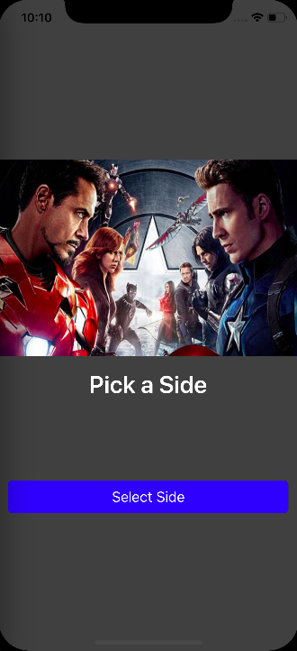
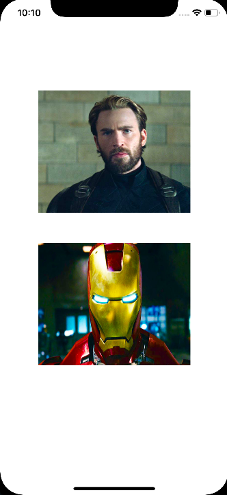
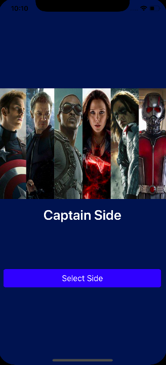
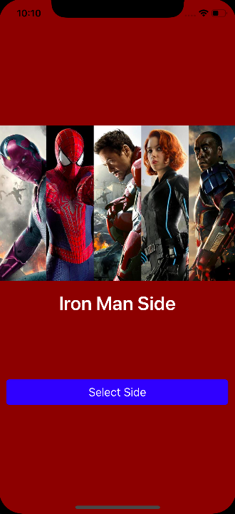

# Communication-Patterns

How to communicate the view controllers with each other, using different patterns.

## Protocols and Delegations

>  A protocol defines a blueprint of methods, properties, and other requirements that suit a particular task or piece of functionality. The protocol can then be adopted by a class, structure, or enumeration to provide an actual implementation of those requirements. Any type that satisfies the requirements of a protocol is said to conform to that protocol.

[Apple Documentation](https://developer.apple.com/library/content/documentation/Swift/Conceptual/Swift_Programming_Language/Protocols.html)

```Swift
// MARK: - setting protocol to select team
protocol SelectYourSideDelegate {
    func  didSelectSide(img: UIImage, name: String, color: UIColor)
}

// In the same or sender vc declare delegate and storage in a variable to be reach it.
var selectedSideDelegate: SelectYourSideDelegate!

// MARK: - extension set protocole on main or reciever vc
extension ViewController: SelectYourSideDelegate {
    func didSelectSide(img: UIImage, name: String, color: UIColor) {
        imageView.image = img
        sideLabel.text = name
        view.backgroundColor = color
    }
}

// Wher the sender is instantiated we set it as delegate
@objc func handleSelectSide(){
    let captainController = CaptainTeam()
    // MARK: - setting delegation from selection view to main view
    captainController.selectedSideDelegate = self
    present(captainController, animated: true, completion: nil)
}
```
|   |
|:--:|
| *Main and Sender.- "Pick a Team"* |
|   |
| *Once you pick a team. Receiver VC will be delegated to do something, depending on what you pick* |
