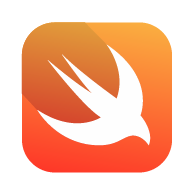

# Communication-Patterns



==How to communicate the view controllers with each other, using different patterns==

## Protocols and Delegations

>  A protocol defines a **blueprint** of methods, properties, and other requirements that suit a particular task or piece of functionality. The protocol can then be adopted by a class, structure, or enumeration to provide an actual implementation of those requirements. Any type that satisfies the requirements of a protocol is said to conform to that protocol.

[Apple Documentation](https://developer.apple.com/library/content/documentation/Swift/Conceptual/Swift_Programming_Language/Protocols.html)

```Swift
// MARK: - setting protocol to select team
protocol SelectYourSideDelegate {
    func  didSelectSide(img: UIImage, name: String, color: UIColor)
}

// In the same or sender vc declare delegate and storage in a variable to be reach it.
var selectedSideDelegate: SelectYourSideDelegate!

// MARK: - extension set protocole on main or reciever vc
extension ViewController: SelectYourSideDelegate {
    func didSelectSide(img: UIImage, name: String, color: UIColor) {
        imageView.image = img
        sideLabel.text = name
        view.backgroundColor = color
    }
}

// Wher the sender is instantiated we set it as delegate
@objc func handleSelectSide(){
    let captainController = CaptainTeam()
    // MARK: - setting delegation from selection view to main view
    captainController.selectedSideDelegate = self
    present(captainController, animated: true, completion: nil)
}
```
### How this works on the app..???

|   |
|:--:|
| *Main and Sender.- "Pick a Team"* |
|   |
| *Once you pick a team. Receiver/Main VC will be delegated to do something, depending on what you pick* |

---

## Notification Center

>  A notification dispatch mechanism that enables the **broadcast** of information to registered observers.

[NSNotification Center Documentation](https://developer.apple.com/documentation/foundation/nsnotificationcenter)

```Swift
// MARK: - Observer key values - unique values
let captainTeamKey = "cap.team.key"
let ironManTeamKey = "iron.team.key"

// Sub.MARK: - Notification names
let steve = Notification.Name(captainTeamKey)
let tony = Notification.Name(ironManTeamKey)

// MARK: - We remove the observer after these are been used - deinit will deallocate the observers from memory.
deinit {
    NotificationCenter.default.removeObserver(self)
}

extension ViewController {
// MARK: - Add Observer
/* This function will observe the broadcast information sent it by the selection VC, using key values for each observer.
*/
func createObservers(){
    // Steve Rogers Observers
    NotificationCenter.default.addObserver(self, selector: #selector(updateImage(notf:)), name: steve, object: nil)
    NotificationCenter.default.addObserver(self, selector: #selector(updateName(notf:)), name: steve, object: nil)
    NotificationCenter.default.addObserver(self, selector: #selector(updateView(notf:)), name: steve, object: nil)

    // Tony Stark Observers
    NotificationCenter.default.addObserver(self, selector: #selector(updateImage(notf:)), name: tony, object: nil)
    NotificationCenter.default.addObserver(self, selector: #selector(updateName(notf:)), name: tony, object: nil)
    NotificationCenter.default.addObserver(self, selector: #selector(updateView(notf:)), name: tony, object: nil)
}

// MARK: - Action block checks rather is there information for either team and trigger the data as soon observer find the right key.
@objc func updateImage(notf: NSNotification){
    let isCapTeam = notf.name == steve
    let img = isCapTeam ? UIImage(named: "team-cap")! : UIImage(named: "team-iron")!
    imageView.image = img
}

@objc func updateName(notf: NSNotification){
    let isCapTeam = notf.name == steve
    let name = isCapTeam ? "Captain Team" : "Iron Man Team"
    sideLabel.text = name
}

@objc func updateView(notf: NSNotification){
    let isCapTeam = notf.name == steve
    let viewColor = isCapTeam ? captainColor : ironManColor
    view.backgroundColor = viewColor
    }
}


```

### How this works on the app..???

|   |
|:--:|
| *Once you pick a team. The selection VC send/Broadcast a Notifcation to the app and the main VC will observe this notification using a key value to identify the data that should be displayed. In this case should be an observer for Captain Team and other for Iron Man Team.* |


